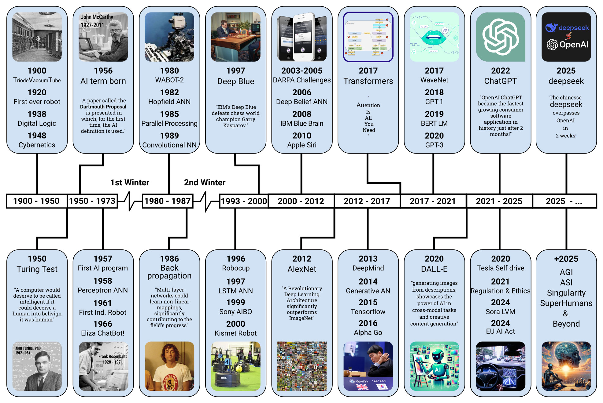

# AI History Timeline
Yet another timeline image for AI history covering the most important events from 1900 to 2025.

## Introduction
All over the Internet, no history timeline image covers all the important events related to AI. So here you can find a full history timeline covering all important events from 1900 to 2025.

## Types of Timeline Images
- **SVG**: The base timeline has been made using Inkscape v1.0.1 and saved as Inkscape compatible SVG with all the guidelines.
- **PNG**: The SVG file has been exported to PNG using Inkscape as a transparent 100dpi image.
- **PDF**: The SVG file has also been exported as a transparent PDF file using Inkscape where all the texts have been converted to paths.
- **JPEG**: The exported PDF file has been converted to JPEG using GIMP 2.10.30 in two versions: 300dpi and 100dpi.

## Image Credits
There have been 18 images used; here are their relative links:
1. [Triode Vacuum Tube](https://edisontechcenter.org/Computers/Eniac-USarmyPhoto700.jpg)
2. [Alan Turing](https://enterrasolutions.com/wp-content/uploads/2022/08/Turing-Alan-blog-768x766.png)
3. [John McCarthy](https://static.independent.co.uk/s3fs-public/thumbnails/image/2011/10/31/20/48-John-McCarthy-AP.jpg)
4. [Frank Rosenblatt](https://news.cornell.edu/stories/2019/09/professors-perceptron-paved-way-ai-60-years-too-soon)
5. [WABOT-2](https://cdn.sanity.io/images/7p2whiua/production/e94572f4926e7bc3a2e85b79cadf37424f161c6c-2048x1536.jpg?rect=497,0,1054,1536&w=1400&auto=format)
6. [Geoffrey Hinton](https://torontolife.mblycdn.com/tl/resized/2018/01/w1280/HINTON_riesbeck.jpg)
7. [Deep Blue vs Kasparov](https://cdn.britannica.com/97/197397-050-A3528661/Deep-Blue-Garry-Kasparov-game-computer-rematch-May-7-1997.jpg?w=300)
8. [MRL MSL Robot](https://scontent-sof1-1.xx.fbcdn.net/v/t39.30808-6/302339139_191583123235617_1029782698923622123_n.jpg)
9. [Apple Siri](https://media.cnn.com/api/v1/images/stellar/prod/111004090302-siri-iphone-4s.jpg)
10. [AlexNet](https://viso.ai/wp-content/uploads/2024/04/ImageNet.jpg)
11. [Transformer](https://decodingdatascience.com/wp-content/uploads/2023/10/Screenshot-2023-10-09-152438.png)
12. [AlphaGo](https://miro.medium.com/v2/resize:fit:720/format:webp/0*gw26I43B0wWY6xCC.jpg)
13. WaveNet - The image was designed
14. DALL-E - Generated by AI
15. [ChatGPT](https://commons.wikimedia.org/wiki/File:ChatGPT_logo.svg)
16. [TESLA](https://images.barrons.com/im-86454177?width=700&size=1.5005861664712778)
17. Deepseek vs OpenAI - self-designed
18. Future of AI-generated using [Bing Image Creator](https://www.bing.com/images/create)

## License
This work has been published under the terms of the MIT License.
